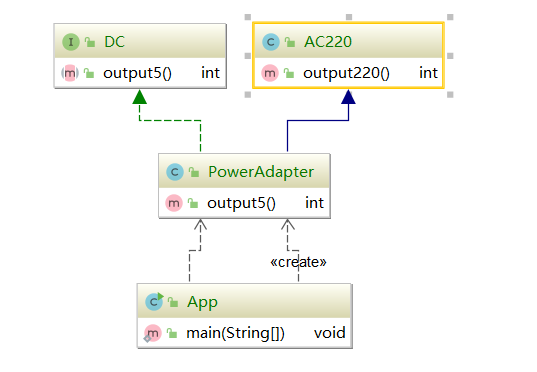
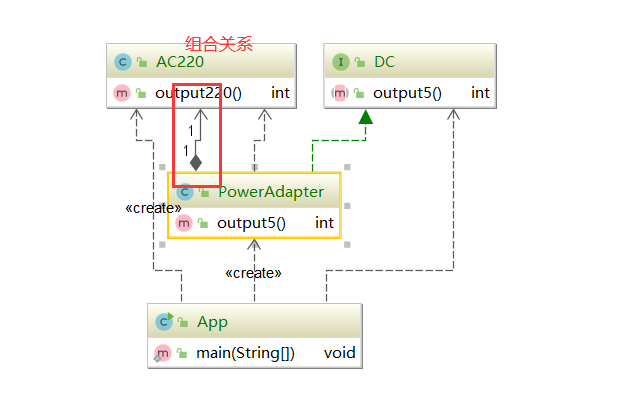
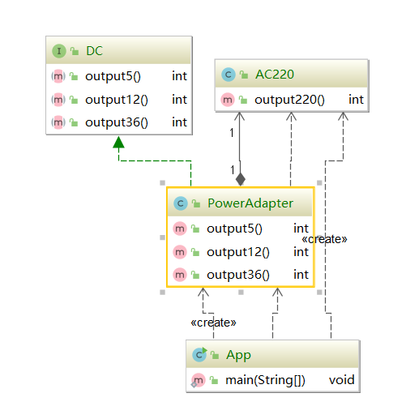
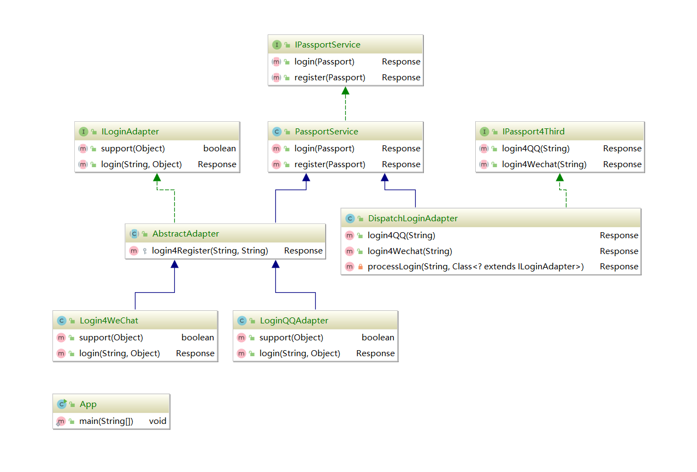

#### 适配器模式（Adapter Pattern）

又叫变压器模式，他的功能是将一个类接口变成客户端所期望的另一种接口，从而使得原本接口不匹配而导致无法一起工作的两个类能够一起工作。

属于结构型设计模式

这是一个亡羊补牢的手段。或者未来可能的手段。主要解决兼容问题

#### 类适配器

#### 对象适配器

#### 接口适配器

#### 适配器的优点

* 能提高类的透明性和复用，现有的类复用但不需要改变
* 目标类和适配器类结构，提高程序的扩展性
* 在很多业务场景中符合开闭原则。

#### 适配器的缺点

* 适配器编写过程需要全部考虑，可能会增加系统的复杂性
* 增加代码阅读难度，降低代码可读性，过多使用适配器会使得系统代码变得凌乱。

`spring`中的`handlerAdapter`，用于处理不同的请求。