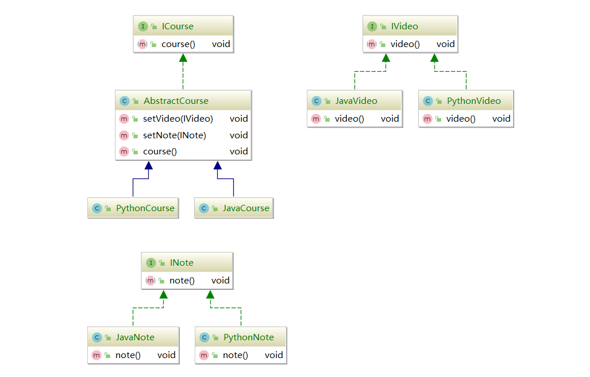
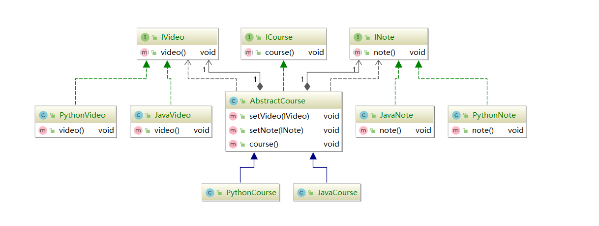

#### 桥接模式（Bridge Pattern）

桥接模式也被称为桥梁模式，接口（interface）模式或者柄体（Handle and  Body）模式，是将部分抽象部分与它具体实现部分分离，使得他们可以独立的变化

通过组合的方式建立两个类之间的联系，而不是继承

多重继承的替代方案

属于结构型模式。


#### 桥接模式的适用场景

* 在抽象和具体实现之间需要增加更多的灵活性场景
* 一个类存在两个（或多个）独立变化的维度，而这两个（或多个）维度都需要独立进行扩展
* 不希望使用**继承**，或因为多层继承导致系统类的个数剧增

理解桥接模式需要分成两步，首先，需要被桥接的两个部分或者更多部分也许是互相好不想干的两个概念，但是使用桥接模式，可以使得他们之前产生关系，例如这里举出的课程，视频，和笔记的概念，这三类都可以有单独的扩展，互相都毫不相干。



但是，一门课程就需要视频，笔记，和课程内容来组合而成，所以，我们需要一个抽象的组件将他们关联起来，用组合的方式。



```
IVideo和INote作为成员变量设置进去，做到不是用继承的方式扩展，之后只需要修改这个组合他们的抽象组件即可。
```

所以，桥接模式将他们的最高层的抽象组合了起来，框定他们之间的关联，至于具体实现，彼此并不想干，就像是你是实现了java的课程，并不会影响java的视频录制一样，因为本质是两个完全不同的东西，但是桥接的抽象组件使得他们关联了起来。

#### 桥接模式的优点

* 分离抽象部分以及具体实现部分
* 提高了系统的拓展性
* 符合开闭原则
* 符合合成复用原则

#### 桥接模式的缺点

* 增加系统的理解与设计难度
* 需要正确地识别系统中两个或者以上的独立变化

#### 在源码中体现

```
jdbc中的DriverManager.getConnetcion()中的DriverManager，桥接了具体mysql实现和java中的sql接口
```

#### 桥接模式和组合模式

桥接模式关注的联系，两个不相干的独立个体产生联系。

组合模式关注是每个被组合进来的类都有一条主线，又或者是有共同点的。

#### 桥接模式和适配器模式

适配器模式关注的兼容，亡羊补牢的手段，又或者是未来拓展的手段。

桥接用于将不相干的两个部分使用一个抽象组件或者一个类组合起来，产生联系。**不像是适配器一样需要用继承或者实现，而是使用组合将他们联系起来**