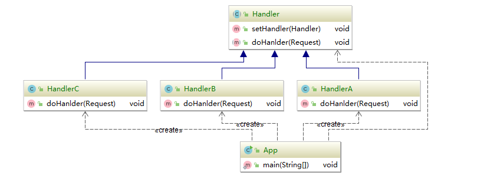

#### 责任链模式

#### 在源码中的体现

servlet 下的filter接口，也就是j2ee标准下的其他框架的实现。

netty中的pipeline中，ChannelHanlder，也有head和tail的属性

#### 责任链模式的优点

* 将请求与处理解耦
* 请求处理者（节点对象）只需要关注自己感兴趣的请求进行处理即可，对于不感兴趣的请求，直接转发给下一节点对象
* 具备链式传递处理请求功能，请求发送者无需知晓链路结构，只需要等待请求处理结果
* 链路结构灵活，可以通过改变链路的结构动态的新增或删除责任
* 易于扩展新的请求处理类（节点），符合开闭原则

#### 责任链的缺点

* 责任链太长或者处理时间过长，会影响整体性能
* 如果节点对象存在循环引用，会造成死循环，导致系统崩溃

权限安全校验框架，大量使用责任链

Spring Security /Apache Shiro