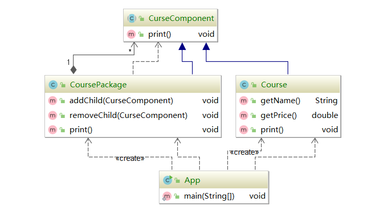

#### 组合模式（Composite Pattern）

也称为整体-部分模型，他的宗旨是通过将单个对象（叶子节点）和组合对象（树枝节点）用相同的借口进行表示。

作用：是客户端对单个对象和组合保持一致的方式处理

属于结构型模式

**具体共同点的行为，具有层级关系的地方可以用组合模式**

理解组合和聚合的差别

组合描述的是一个团队，团队里的每个人都有自己的职责，团队里每个人都很重要，离开谁都不行，谁离开，团队都会解散，又或者是人的身体，人的身体是一个组合关系，四肢和器官离开了身体会迅速死亡，但是在一起可以完好的存活。拥有形同的生命周期

聚合类似于U盘，即便离开了电脑，他也依旧可以正常运作。


#### 组合模式的适用场景

* 希望客户端可以忽略组合对象与单个对象的差异
* 对象层次具备整体和部分，呈现树形结构，如树形菜单，操作系统目录，公司组织架构等


#### 组合模式的安全写法



#### 组合模式的透明写法


#### 组合模式在源码中的体现

HashMap中的addAll方法，由于放入的也是一个map，这是map的最顶层结构，和我们之间讨论的文件夹的实现是一样的。

还有ArrayList中的addAll方法，需要放入Collection，Collection也是list的最高抽象

已经Mybatis中的SqlNode，他的底部也有众多实现

```xml
<select>
    <if></if>
    <foreach></foreach>
</select>
<!-- 全部都用sqlnode来操作，统一的api接口操作-->
```


#### 透明写法和安全写法的选择

首先，组合模式适用于部分节点拥有相同的点的场景，例如文件系统，他们都是文件。树节点，他们都是树的一部分。公司部门，他们都属于一个公司，那么他们都应该具有一些相同的行为可以被抽离到一个公共的抽象组件中。

而透明和安全的区别在于，**抽象组件和具体组件的行为到底差异有多大**，如果你的抽象组件和具体组件之间行为和功能差的不太多，可能实现出来，也就一两个差异的，其实可以把这些都放在抽象组件里，这样具体组件实现起来就会比较简单，透明写法更加好。反之，如果具体实现和抽象组件其实会有比较大的差异，例如一个具体就需要多出三个到四个甚至更多方法来完成这个组件的操作，那么全部抽象到抽象组件里就有些不妥，因此选择安全写法，让具体组件实现自己的逻辑，只要完成抽象组件里统一的方法就行。

保证调用相同的方法，就可以完成他们的响应的操作。


#### 组合模式的优点

* 清楚地定义分层次的复杂对象表示对象的全部或者部分层次
* 让客户端忽略层次的差异，方便对整个层次结构进行控制
* 简化客户端代码
* 符合开闭原则

#### 组合模式的缺点

* 限制类型的较为复杂
  * 由于只能操作同一类型，也就是抽象组件的对象，所以比较局限
* 使得设计变得更加抽象
  * 定义最高层的抽象组件，需要你对这个业务有深刻的理解，才能设计出最高层抽象组件需要什么行为应该被定义在上面。