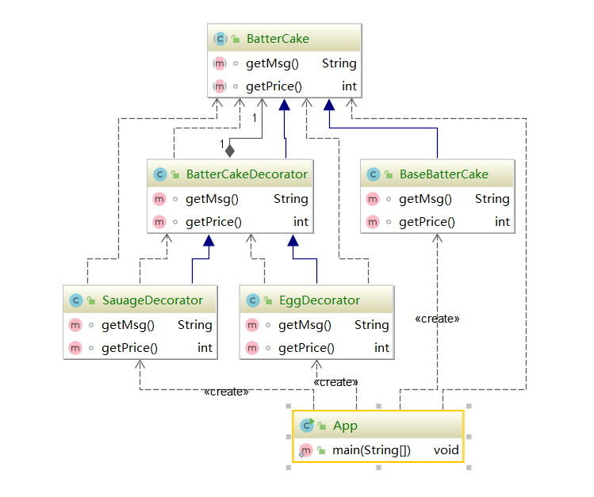

#### 装饰器模式(Decorator Pattern)

装饰器模式，也叫包装模式（wrapper pattern），是指在不改变原有对象的基础上，将功能附加到对象上，提供了比继承更加有弹性的替代方案（拓展原有对象的功能）

属于结构型模式


#### 装饰器模式的适用场景

* 用于扩展一个类的功能或给一个类添加附加职责
  * 和建造者模式不同的是，建造师是将构建的过程交给你定制。
  * 但是装饰器是将功能交给你定制。
* 动态的给一个对象添加功能，这个功能还可以再动态撤销。

```java
/**
 * @author Pop
 * @date 2020/7/16 23:57
 *
 * 装饰器三件套之一
 * 抽象组件，由于定义某个功能的接口
 */
public abstract class BatterCake {

    abstract String getMsg();

    abstract int getPrice();

}

/**
 * @author Pop
 * @date 2020/7/16 23:59
 *
 * 装饰器模式三件套之二
 *
 * 一个默认的实现
 */
public class BaseBatterCake extends BatterCake {
    @Override
    String getMsg() {
        return "基础面皮";
    }

    @Override
    int getPrice() {
        return 2;//一张面皮两块
    }
}

/**
 * @author Pop
 * @date 2020/7/17 0:00
 *
 * 裝飾器模式三件套之三
 *
 * 装饰器的实现，他需要继承之前抽象组件
 */
public class BatterCakeDecorator extends BatterCake {

    /**
     * 同时持有抽象组件的成员
     */
    private BatterCake batterCake;

    /**
     * 必须存在带有抽象组件的参数的构造方法，用于包装
     * @param batterCake
     */
    public BatterCakeDecorator(BatterCake batterCake) {
        this.batterCake = batterCake;
    }

    @Override
    String getMsg() {
        return batterCake.getMsg();
    }

    @Override
    int getPrice() {
        return batterCake.getPrice();
    }
}

/**
 * @author Pop
 * @date 2020/7/17 0:00
 *
 * 鸡蛋的实现
 */
public class EggDecorator extends BatterCakeDecorator {

    /**
     * 必须存在带有抽象组件的参数的构造方法，用于包装
     * @param batterCake
     */
    public EggDecorator(BatterCake batterCake) {
        super(batterCake);
    }

    @Override
    String getMsg() {
        return super.getMsg()+" 加一个鸡蛋";
    }

    @Override
    int getPrice() {
        return super.getPrice()+1;
    }
}
//...

public class App {

    public static void main(String[] args) {
	//看起来类似这样
        BatterCake batterCake;

        batterCake = new BaseBatterCake();

        batterCake = new EggDecorator(batterCake);

        batterCake = new EggDecorator(batterCake);

        batterCake = new SauageDecorator(batterCake);

        System.out.println(batterCake.getMsg()+" "+batterCake.getPrice());
        //out 基础面皮 加一个鸡蛋 加一个鸡蛋 加一个香肠 6
    }
}
```



#### 装饰器模式和代理模式对比

* 装饰器模式是一种特殊的代理模式
* 装饰器强调自身的功能扩展，可动态定制的扩展
* 代理模式强调的是代理过程的控制


#### 装饰器模式的优点

* 装饰器是继承的有力补充，比继承灵活，不改变原有对象的情况下，动态的给对象扩展一个功能，即插即用。
* 通过使用不同装饰器以及这些类的组合，可实现不同的效果。
* 装饰器完全遵循开闭原则。

#### 装饰器模式的缺点

* 会出现更多代码和类，增加复杂性
* 动态装饰的时，会出现多层嵌套