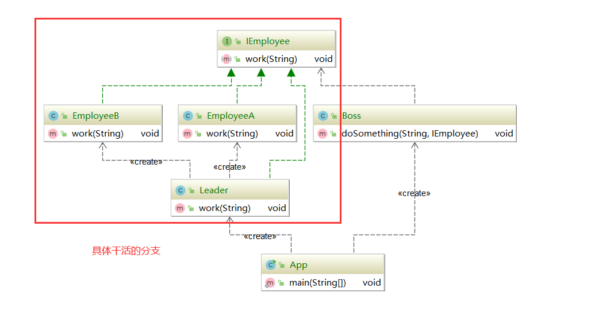

#### 委派模式（Delegate Pattern）

又叫委托模式。它的基本作用就是负责任务的调度和任务分配，将任务的分配和执行分离开来。可以看做是一种特殊情况下的静态代理的全权代理。

不属于GOF 23 种设计模式之一

**属于行为型模式**

委派和代理需要区别的是，委派是完全是自己不干活的，是交给其他具体的实现类去做，一般有路由到其他更适合的干活的人的作用，所以和策略结合会比较好。

#### 委派模式的应用场景

* 委派对象本身不知道如何处理一个任务（或一个请求），把请求交给其他对象来处理。
* 实现程序的解耦

委派模式在生活场景中的应用

老板给员工下达任务

#### 源码体现

双亲委派`classLoader#loadClass()`

springMVC 中的 dispatchServlet中的doDispatch

#### 委派模式的优点

通过任务委派能够将一个大型任务细化，然后通过统一管理这些子任务完成情况实现任务的跟进，能够加快任务的执行效率

#### 委派模式的缺点

任务委派需要根据任务的复杂程度进行不同的改变，在任务比较复杂的情况下会更加复杂

#### 委派模式和代理模式的区别

* 委派模式是行为模式，代理模式是结构型模式
* 委派模式注册的是任务派遣，注重结果；代理模式注重的是代码增强，注重过程
* 委派模式是一种特殊的静态代理，相当于全权代理

#### 委派模式和门面模式的区别

之前我们说到门面模式，他将多个功能，多个职责都聚合在一个类中，并向外提供统一的方法，是一种强悍的调度，属于结构型模式。

而委派模式则只能对某一种功能进行调度，例如举的例子，让软件的项目经理去调度擅长不同领域技术的程序员，他是可以的，但是让他去调度销售的人才，他是不了解的，因为他不熟悉，无法调度。属于行为型模式。

