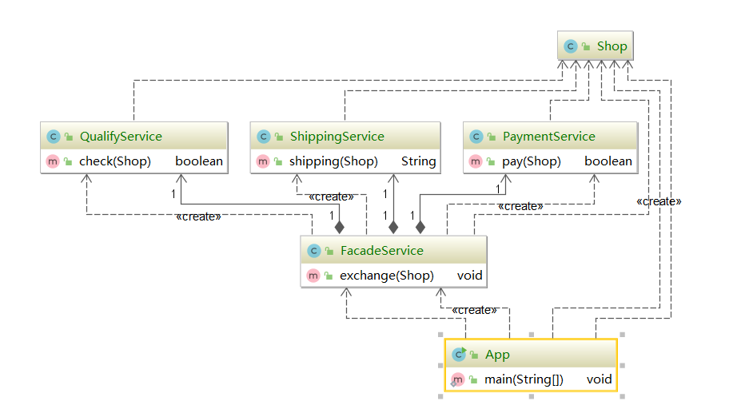

####  门面模式 Facade Pattern

又叫外观模式，提供了一个统一的借口，用来访问子系统中的一群借口。特征，门面模式定义了一个高层借口，让子系统更容易使用，属于**结构型模式**

子系统越来越复杂，增加门面模式提供简单接口。



参考前台招待，他会帮助你完成所有流程，你需要和他交流，他们会帮你完成。


```java
public class App {

    public static void main(String[] args) {

        FacadeService facadeService = new FacadeService();

        Shop shop = new Shop("《Pop 与 Pipi 美》");

        //对于调用者来说，只需要这一步
        facadeService.exchange(shop);


    }

}
```

门面模式的体现，spring中的`JdbcUtils`，tomcat中的`RquestFacade`和`ResponseFacade`


#### 门面模式与代理模式

门面模式是特殊的静态代理模式，一般说的代理模式一般是动态代理。

门面模式：重点在于封装

静态代理：重点在于增强

不做增强的静态代理就是门面模式。

#### 门面模式与单例模式

门面模式容易做成单例模式，例如Utils的工具包。


#### 门面模式的优点

* 简化调用过程，无须深入了解子系统，以防止给子系统带来风险
* 减少系统以来、松散耦合（针对调用方说，例如mvc，controller层只需要调用一个service方法，就可以完成一个逻辑的全部的复杂操作）
* 更好划分层次，提高安全性，还是mvc为例子。
* 遵守迪米特发展，即最少知道原则、

#### 门面模式的缺点

* 增加子系统和扩展子系统，可能带来风险
* 不符合开闭原则
* 有时候违背唯一单一职责原则