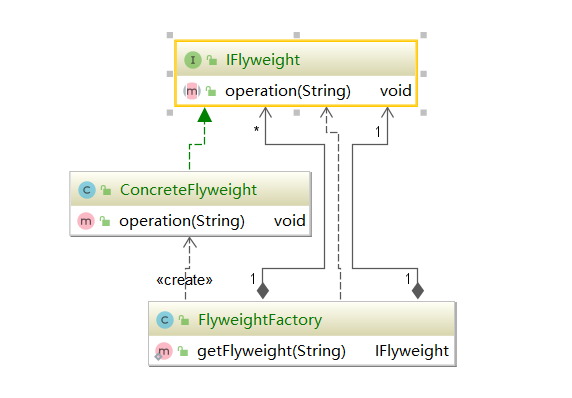

#### 享元模式（Flyweight Pattern）

**享元模式的定义：**

享元模式，又称为轻量级模式，是对象池的一种实现。类似线程池，线程池可以避免不停的创建和销毁多个对象，消耗性能。提供了减少对象数量从而改善应用所需要的对象结构方式。

宗旨：共享细粒度对象，将多个对同一对象的访问集中管理起来。

**属于结构型模式**


代表共享的同一种资源的情况，例如共享单车，房源。


#### 适用场景

* 常常应用于系统底层的开发，以便解决系统的性能问题。
* 系列有大量的相似对象、需要缓冲池的场景

享元常常和工厂模式在一起使用。



源码中的享元

String的享元类型

```java
/*
我们都知道 String 是不属于java的基本类型，他是属于对象，也就是引用类型，既然是引用类型，那么对象之间的比较就应该是地址的比较。
*/

String s1 = "hello";

String s2 = "hello";

String s3 = "he"+"llo";

String s4 = "hel"+new String("lo");

String s5 = new String("hello");

String s6 = s5.intern();//将这个对象的字符串地址返回，也就是常量池对应的地址

String s7 = "h";

String s8 = "ello";

String s9 = s7+s8;

/*
问题在于为什么对象之间的比较，会是相同的呢，这是因为jvm底层对String类型做了优化，被初始化的已经确定好的，“hello” 在编译阶段就可以初始化完毕，运行阶段进行赋值给s1，所有的常量都存放在常量池中，所有对于s2而言，他的对应的字符串，已经在常量池里面缓存好了，所有直接指向就可以了，所以他们其实同一个对象，自然相等。
这就是享元对象的体现，将对象（字符）集中管理起来。
*/

s1 == s2 //true

/*
当然，这个我们在平时使用的时候，即便这样拼接也可以相同的，这其实也是jvm对String类型的优化，因为这个常量(已经确定的变量)在编译器阶段就已经确定了，所有其实在编译阶段，这还是会编译成hello这样字符串。存入常量池
*/    
    
s1 == s3 //true

/*
s4的初始化涉及三个变量，hel / new String() / lo，lo的地址赋值给了new String内部的常量后，再次和hel进行了拼接，所以对象地址不再正确
*/

s1 == s4 //false

/*

参考s4 的初始化，其实这个时候的地址已经指向了 new String()这样对象地址，而不是常量池
*/


s1 == s5 //false
//这也是肯定的
s4 == s5 //false
//因为是返回了对应字符串的常量池地址，所以一致
s1 == s6 //true

//这是因为，对于编译阶段而言，s9其实是s7和s8拼接而成，s7和s8拥有自己的常量池地址
//所以对于s1来说，其实比较的是 hello 地址 与 h 地址 和ello地址
//这也说明了其实机器也没那么聪明，他只能在一开始就知道比常量的起始状态，无法预测他未来会是什么状态
//还有就是，java在编译阶段只针对常量进行处理，而这个时候的s7+s8在这个时候是变量，运行阶段处理。所以无法将他们拼接处理
s1 == s9 //false

String s1 = new String("hello");
        String s2 = new String("hello");
        System.out.println(s1==s2);//false
        System.out.println(s1.intern()==s2.intern());//true


// Integer.valueOf()
// Integer与int存在自动装箱拆箱机制
/*
但是在valueOf其实也是做了缓存的，就是 -127 ~ 128 数字的缓存
超过这个范围，就会返回 new Integer这样的对象了，所以就会出现这样的情况
*/
Integer i1 = Integer.valueOf(128);
Integer i2 = 128;

Integer i3 = Integer.valueOf(129)
Integer i4 =127;

i1 == i2 //true
i3 == i4 //false    
  
// Integer.java
  public static Integer valueOf(int i) {
        if (i >= IntegerCache.low && i <= IntegerCache.high)
            return IntegerCache.cache[i + (-IntegerCache.low)];
        return new Integer(i);
    }   
    
```

#### 享元模式扩展知识

* 内部状态
  * 即该资源的本身的属性，他不会因为外部环境的改变而改变，例如之前演示过的数据库连接池场景，他的用户名密码，还有jdbc驱动，连接url等信息就可以定义为他的内部状态，因为不管如何，他都是固定的不会改变。不会因为重复利用而改变
* 外部状态
  * 回因为环境的改变而发生变化的属性，例如这个连接当被使用完成后，被释放，就需要给这个连接按上**已经关闭的状态**之类的，会随着外部系统改变而发生改变，例如，活跃中，已经关闭，已经超时等信息。

享元模式是用于控制细粒度的资源，这些资源大多很相近，所有就需要某些标志用于区别他们，所有内部状态和外部状态的使用也比较关键，之后设计的时候，请多加考虑，这些资源有哪些内部状态，又有哪些不可改变的外部状态，用于区别资源之间的类别。


#### 享元模式的优点

* 减少对象的创建，降低内部的对象数量，降低系统的内存，提高效率
* 减少内存之外的其他资源占有（带宽，连接数等）

#### 享元模式的缺点

* 关注内、外部状态，关注线程安全问题
* 使系统、程序的逻辑复杂化


**享元模式和代理模式的区别**

享元虽然也是对某个对象的持有，但是其实是为了去管理这些多数的对象而存在的，重点在于**管理**。

而代理模式在于**增强**，着重点不一样

**享元模式和单例模式**

享元模式和单例模式经常一起配合使用，因为存储缓存的地方也只需要一个就够了，当然也会工厂模式。