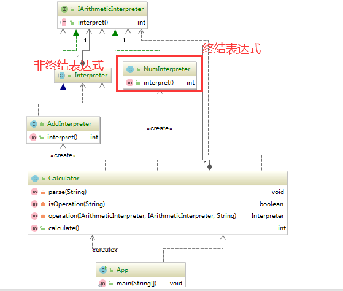

#### 解释器模式（Interpreter Pattern）

给定一个语言，定义它的文法的一种表示，并定义一个解释器，这个解释器使用该表示来解释语言中的句子。

特征：为了解释一种语言，而为语言创建的解释器

属于**行为型模式**

#### 解释器模式的适用场景

* 一些重复出现的问题可以用一种简单的语言进行表达；
* 一个简单的语法需要解释的场景

`1+2`，1和2是终结表达式，+作为连接他们之间的就是非终结表达式，解释器模式用于将他们具体的含义解释出来的模式。

解释器模式两步，编译和解析

#### 源码中的体现

java.util.regx中的Pattern，spring中的ExpressionParser

#### 解释器模式优点

* 扩展性强：在解释器模式中由于语法是由很多类表示，当语法规则更改时，只需要**修改**相应的非终结表达符即可；若拓展语法时，只需要**添加**对应的非终结表达符即可
* 增加了新的解释器表达式的方式
* 易于实现文法，解释器模式对应的文法应当是**比较简单**且易于实现的，**过于复杂**的语法就不适合的使用解释器模式

#### 解释器模式缺点

* 语法规则复杂，会引起类的膨胀
* 执行效率比较低

