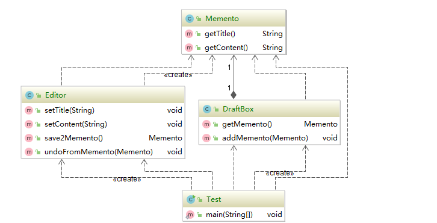

#### 备忘录模式（Memento Pattern）

又称为快照模式（Snapshot Pattern）或者令牌模式（Token Pattern），是指的在不破坏封装前提下，捕获一下对象的内部状态，并在对象之外保存这个状态，这样以后就可将改对象恢复到原先保存的状态。

特征：“后悔药”

**属于行为性模式**

类似游戏的 撤销，存档之类的操作

#### 备忘录模式的适用场景

* 需要保存历史快照的场景
* 希望对象之外保存状态，且除了自己其他类对象无法访问状态保存具体内容

