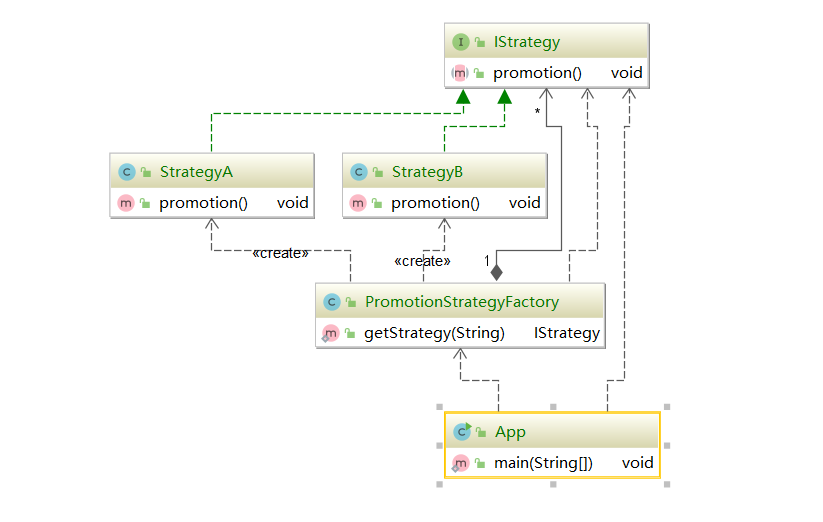

#### 策略模式（Strategy Pattern）

也叫政策模式（Policy Pattern），它是从定义的算法家族，分别封装起来，让他们之间可以互相替换，从而让算法的变化不会影响到使用算法的用户。

可以避免多重分支的`if...else...`和`switch`语句

**属于行为型模式**

单一的委派模式一种体现。

#### 策略模式的适用场景

* 假如系统中有很多类，而他们的区别仅仅在于他们的行为不同。
* 一个系统需要动态地集中算法中选择一种
* 需要屏蔽算法的规则

#### 策略模式的优点

* 策略模式符合开闭原则
* 避免使用多重条件转移语句，如`if...else...`语句、`switch` 语句
* 使用策略模式可以提高算法的保密性和安全性

#### 策略模式的缺点

* 客户端必须知道所有的策略，并自行决定使用哪一个策略类
* 代码中会产生非常多的策略类，增加维护难度

#### 源码中的体现

`comparator#compare()`

spring中的resource，不同资源的抽象，包括对象和配置文件