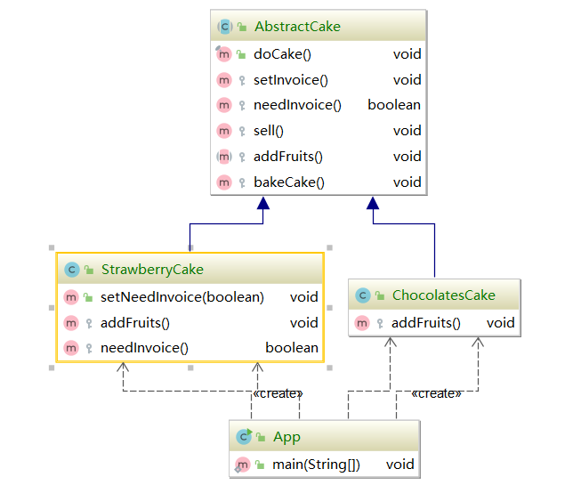

#### 模版方法模式（Template method pattern）

又被成为模版模式，是指定义一个算法的骨架，并允许子类为其中的一个或者多个步骤提供实现。

模版方法使得子类可以在不改变算法结构的情况下，重新定义算法的某些步骤。

属于**行为性设计模式**

#### 模版模式的适用场景

* 一次性实现一个算法不变的部分，并将可变的行为留给子类来实现。
* 各子类中的公共行为被提取出来并集中在一个公共的父类中，从而避免代码的重复。

子类通过覆盖重写父类的方法，或者实现抽象方法来改变父类的某个阶段的结果，但是不影响整体流程

#### 模版方法的源码应用

spring中的jdbcTemplate，jdk中的 AbstractList，mybatis中的BaseExcutor

#### 模版方法的优点

* 利用模版方法将相同处理逻辑的代码放到抽象父类中，可以提高代码的复用性。将不同的代码不同的子类中，通过对子类的拓展增加新的行为，提高代码的扩展性。
* 把不变的行为写到父类上，去除子类的重复代码，提供一个很好的代码复用平台，符合开闭原则

#### 模版方式的缺点

* 类数目的增加，每个抽象类都需要以一个子类来实现，这样导致类的个数增加
* 类数据的增加，间接地增加系统的实现复杂度。
* 集成关系的自身缺点，如果父类添加的新的抽象方法，所有的子类都要改

**模版方法模式一定只能使用继承实现。**

